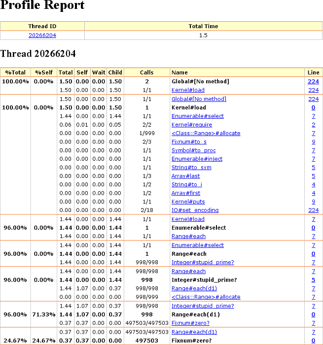

!SLIDE

# profiling Ruby

!SLIDE

!SLIDE bullets incremental

# Project Euler

* problem 10:

* The sum of the primes below 10 is 2 + 3 + 5 + 7 = 17.

* Find the sum of all the primes below two million.

!SLIDE

    @@@ Ruby

    class Integer

      def stupid_prime?
        prime = true
        (2...self).each { |i| prime = false if (self % i).zero? }
        prime
      end

    end

!SLIDE

    @@@ Ruby

    # ruby euler.rb 2_000_000 stupid_prime?

    require './integer'

    limit  = ARGV.first.to_i
    method = ARGV.last.to_sym

    sum = (2...limit).select(&method).inject :+

    puts "sum(primes < #{limit}) = #{sum}"

!SLIDE commandline incremental

    $ ruby euler.rb 10 stupid_prime?
    sum(primes < 10) = 17

    $ ruby euler.rb 2_000_000 stupid_prime?
    ^C…/integer.rb:5:in `block in stupid_prime?': Interrupt
            from …/integer.rb:5:in `each'
            from …/integer.rb:5:in `stupid_prime?'
            from euler.rb:3:in `each'
            from euler.rb:3:in `select'
            from euler.rb:3:in `<main>'

!SLIDE

!SLIDE commandline incremental

    $ time ruby euler.rb 1_000 stupid_prime?
    sum(primes < 1000) = 76127

    real    0m0.558s
    user    0m0.488s
    sys     0m0.068s

!SLIDE

# require 'profile'

!SLIDE commandline incremental

    $ time ruby -r profile euler.rb 1_000 stupid_prime?
    sum(primes < 1000) = 76127
      %   cumulative   self              self     total
     time   seconds   seconds    calls  ms/call  ms/call  name
     66.99    18.85     18.85      999    18.87    53.72  Range#each
     14.93    23.05      4.20   497506     0.01     0.01  Fixnum#%
     13.47    26.84      3.79   497720     0.01     0.01  Fixnum#zero?
      1.14    27.16      0.32      104     3.08    24.04  Kernel.require
      0.46    27.29      0.13      184     0.71     3.21  Array#each
      0.25    27.36      0.07      630     0.11     2.08  Class#new
      0.21    27.42      0.06     2640     0.02     0.03  Kernel.===
      0.21    27.48      0.06       88     0.68     1.82  Gem::Dependency#initialize
      0.14    27.52      0.04      305     0.13     0.23  Array#map
      0.14    27.56      0.04      137     0.29     0.29  Dir#[]
    […]

    real    0m28.966s
    user    0m28.174s
    sys     0m0.768s

!SLIDE

!SLIDE

# gem install ruby-prof

!SLIDE commandline incremental

    $ time ruby-prof euler.rb 1_000 stupid_prime?
    sum(primes < 1000) = 76127
    Thread ID: 5985476
    Total: 1.490000

     %self     total     self     wait    child    calls  name
     65.77      1.39     0.98     0.00     0.41      998  Range#each(d1)
     27.52      0.41     0.41     0.00     0.00   497503  Fixnum#zero?
      2.01      0.05     0.03     0.00     0.02        6  Kernel#require(d2)
      1.34      1.42     0.02     0.00     1.40      998  Integer#stupid_prime?
      0.67      0.01     0.01     0.00     0.00      999  <Class::Range>#allocate
      0.67      0.01     0.01     0.00     0.00        2  Kernel#caller
      0.67      0.01     0.01     0.00     0.00       90  Module#module_eval
      0.67      0.01     0.01     0.00     0.00        2  Kernel#require(d3)
      0.67      1.43     0.01     0.00     1.42        1  Range#each
    […]

    real    0m1.948s
    user    0m1.444s
    sys     0m0.480s

!SLIDE commandline incremental

    $ ruby-prof -p graph_html -f euler.html euler.rb 1_000 stupid_prime?

!SLIDE

!SLIDE

# gem install perftools.rb

!SLIDE commandline incremental

    $ export CPUPROFILE=euler

    $ export CPUPROFILE_FREQUENCY=4000

    $ time ruby -r perftools euler.rb 1_000 stupid_prime?
    sum(primes < 1000) = 76127
    PROFILE: interrupts/evictions/bytes = 134/0/4920

    real    0m0.597s
    user    0m0.488s
    sys     0m0.100s

    $ pprof.rb --text euler
    Total: 134 samples
          60  44.8%  44.8%       76  56.7% Kernel#require
          28  20.9%  65.7%       32  23.9% Range#each
          14  10.4%  76.1%       14  10.4% garbage_collector
           8   6.0%  82.1%        8   6.0% Dir.[]
           5   3.7%  85.8%       11   8.2% Kernel#eval
           4   3.0%  88.8%        4   3.0% Fixnum#zero?
    […]

!SLIDE commandline incremental

    $ time ruby euler.rb 10_000 stupid_prime?
    sum(primes < 10000) = 5736396

    real    0m13.234s
    user    0m13.157s
    sys     0m0.092s

    $ time ruby -r perftools euler.rb 10_000 stupid_prime?
    sum(primes < 10000) = 5736396
    PROFILE: interrupts/evictions/bytes = 3403/0/5272

    real    0m13.691s
    user    0m13.533s
    sys     0m0.140s

    $ pprof.rb --text euler
    Total: 3403 samples
        3052  89.7%  89.7%     3299  96.9% Range#each
         245   7.2%  96.9%      245   7.2% Fixnum#zero?
          57   1.7%  98.6%       75   2.2% Kernel#require
          16   0.5%  99.0%       16   0.5% garbage_collector
           7   0.2%  99.2%        7   0.2% Dir.[]
           5   0.1%  99.4%       12   0.4% Kernel#eval
    […]

    $ pprof.rb --pdf euler > euler.pdf
    Dropping nodes with <= 17 samples; edges with <= 3 abs(samples)

!SLIDE

!SLIDE

    @@@ Ruby

    class Integer

      def stupid_prime?
        prime = true
        (2...self).each { |i| prime = false if (self % i).zero? }
        prime
      end

    end

!SLIDE

    @@@ Ruby

    class Integer

      def tedious_prime?
        (2...self).each { |i| return false if (self % i).zero? }
        true
      end

    end

!SLIDE

    @@@ Ruby

    class Integer

      def tedious_prime?
        (2...self).all? { |i| (self % i).nonzero? }
      end

    end

!SLIDE commandline incremental

    $ time ruby euler.rb 20_000 tedious_prime?
    sum(primes < 20000) = 21171191

    real    0m7.638s
    user    0m7.564s
    sys     0m0.064s

    $ time ruby -r perftools euler.rb 20_000 tedious_prime?
    sum(primes < 20000) = 21171191
    PROFILE: interrupts/evictions/bytes = 1975/0/5776

    real    0m7.952s
    user    0m7.860s
    sys     0m0.092s

    $ pprof.rb --pdf euler > euler.pdf
    Dropping nodes with <= 9 samples; edges with <= 1 abs(samples)

!SLIDE

!SLIDE

    @@@ Ruby

    class Integer

      def tedious_prime?
        (2...self).all? { |i| (self % i).nonzero? }
      end

    end

!SLIDE

    @@@ Ruby

    class Integer

      def simple_prime?
        (2..Math.sqrt(self).floor).all? { |i| (self % i).nonzero? }
      end

    end

!SLIDE commandline incremental

    $ time ruby euler.rb 20_000 tedious_prime?
    sum(primes < 20000) = 21171191

    real    0m7.638s
    user    0m7.564s
    sys     0m0.064s

    $ time ruby euler.rb 20_000 simple_prime?
    sum(primes < 20000) = 21171191

    real    0m0.653s
    user    0m0.576s
    sys     0m0.076s

    $ time ruby euler.rb 200_000 simple_prime?
    sum(primes < 200000) = 1709600813

    real    0m3.565s
    user    0m3.464s
    sys     0m0.100s

!SLIDE bullets incremental

* cool story, bro, but…
* `require 'prime'`
* gives us
* Integer#prime?
* like, already.

!SLIDE commandline incremental

    $ time ruby euler.rb 200_000 simple_prime?
    sum(primes < 200000) = 1709600813

    real    0m3.565s
    user    0m3.464s
    sys     0m0.100s

    $ time ruby euler.rb 200_000 prime?
    sum(primes < 200000) = 1709600813

    real    0m6.734s
    user    0m6.636s
    sys     0m0.080s

    $ time ruby -r perftools euler.rb 200_000 prime?
    sum(primes < 200000) = 1709600813
    PROFILE: interrupts/evictions/bytes = 1687/0/6928

    real    0m6.799s
    user    0m6.720s
    sys     0m0.072s

!SLIDE commandline incremental

    $ pprof.rb --text euler
    Total: 1687 samples
         704  41.7%  41.7%     1191  70.6% Kernel#loop
         274  16.2%  58.0%     1006  59.6% Proc#call
         258  15.3%  73.3%      258  15.3% garbage_collector
         150   8.9%  82.2%      150   8.9% Fixnum#divmod
          68   4.0%  86.2%     1311  77.7% Prime#prime?
          62   3.7%  89.9%      584  34.6% Prime::Generator23#succ
          53   3.1%  93.0%       68   4.0% Kernel#require
          17   1.0%  94.0%     1208  71.6% Prime::PseudoPrimeGenerator#each
          13   0.8%  94.8%     1328  78.7% Class#prime?
          12   0.7%  95.5%     1340  79.4% Integer#prime?
          11   0.7%  96.1%       21   1.2% Prime::Generator23#initialize
          11   0.7%  96.8%       11   0.7% Prime::PseudoPrimeGenerator#initialize
          10   0.6%  97.4%     1273  75.5% BasicObject#singleton_method_added
           9   0.5%  97.9%     1349  80.0% Range#each
           7   0.4%  98.3%        7   0.4% Dir.[]
           4   0.2%  98.6%        4   0.2% Class#instance
           4   0.2%  98.8%       12   0.7% Kernel#eval
           4   0.2%  99.1%        4   0.2% Prime::Generator23.allocate
    […]

    $ pprof.rb --pdf euler > euler.pdf
    Dropping nodes with <= 8 samples; edges with <= 1 abs(samples)

!SLIDE

!SLIDE

# require 'benchmark'

!SLIDE

    @@@ Ruby
    require 'benchmark'
    require 'integer'
    require 'prime'
    Benchmark.bmbm do |bench|
      bench.report 'stupid:' do
        (2..10_000).each { |i| i.stupid_prime? }
      end
      bench.report 'tedious:' do
        (2..10_000).each { |i| i.tedious_prime? }
      end
      bench.report 'simple:' do
        (2..10_000).each { |i| i.simple_prime? }
      end
      bench.report 'clever:' do
        (2..10_000).each { |i| i.clever_prime? }
      end
      bench.report 'stdlib:' do
        (2..10_000).each { |i| i.prime? }
      end
    end

!SLIDE commandline incremental

    $ ruby benchmark.rb
    Rehearsal --------------------------------------------
    stupid:   11.890000   0.010000  11.900000 ( 11.945490)
    tedious:   2.000000   0.000000   2.000000 (  2.015766)
    simple:    0.070000   0.000000   0.070000 (  0.071036)
    clever:    0.050000   0.000000   0.050000 (  0.042739)
    stdlib:    0.140000   0.000000   0.140000 (  0.140070)
    ---------------------------------- total: 14.160000sec

                   user     system      total        real
    stupid:   11.900000   0.020000  11.920000 ( 11.974419)
    tedious:   1.990000   0.000000   1.990000 (  2.001525)
    simple:    0.070000   0.000000   0.070000 (  0.067571)
    clever:    0.040000   0.000000   0.040000 (  0.043885)
    stdlib:    0.130000   0.000000   0.130000 (  0.131435)

!SLIDE

    @@@ Ruby

    require 'benchmark'
    require 'integer'
    require 'prime'

    Benchmark.bmbm do |bench|
      bench.report 'simple:' do
        (2..100_000).each { |i| i.simple_prime? }
      end
      bench.report 'clever:' do
        (2..100_000).each { |i| i.clever_prime? }
      end
      bench.report 'stdlib:' do
        (2..100_000).each { |i| i.prime? }
      end
    end

!SLIDE commandline incremental

    $ ruby benchmark-stdlib.rb
    Rehearsal -------------------------------------------
    simple:   1.160000   0.000000   1.160000 (  1.168574)
    clever:   0.670000   0.000000   0.670000 (  0.669668)
    stdlib:   2.140000   0.000000   2.140000 (  2.158855)
    ---------------------------------- total: 3.970000sec

                  user     system      total        real
    simple:   1.170000   0.000000   1.170000 (  1.169250)
    clever:   0.670000   0.000000   0.670000 (  0.669276)
    stdlib:   2.160000   0.020000   2.180000 (  2.186799)

!SLIDE

    @@@ Ruby

    class Integer

      def simple_prime?
        (2..Math.sqrt(self).floor).all? { |i| (self % i).nonzero? }
      end

      def clever_prime?
        return true  if self == 2
        return false if self.even?
        3.step(Math.sqrt(self).floor, 2).all? { |i| (self % i).nonzero? }
      end

    end
